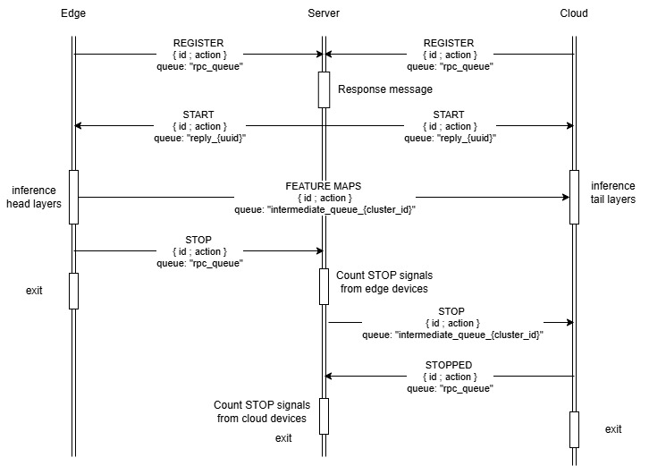

# Split Inference

This project implements **Split Inference for YOLOv11** to enable real-time object detection on low-power **edge devices (Jetson Nano)** by dividing the neural network across multiple machines.

Instead of transmitting full video frames, the edge device executes the first part of the model (**head**) and sends only **intermediate feature maps** to another device that runs the remaining layers (**tail**).

---

# Table of Contents

* [Overview](#overview)
* [Architecture](#architecture)
<!-- * [Data Flow](#data-flow) -->
* [Pipeline](#pipeline)
* [Project Structure](#project-structure)
* [How to Run](#how-to-run)

  * [Clone Repository](#1-clone-the-repository)
  * [Install Dependencies](#2-install-dependencies)
  * [Start RabbitMQ](#3-start-rabbitmq)
* [Configuration](#configuration)
* [Running the System](#running-the-system)
* [Automatic Partitioning](#automatic-partitioning)
* [Tested Hardware](#tested-hardware)
* [Application Scenarios](#application-scenarios)
* [License](#license)

---

# Overview

<p align="center">
  
</p>

In traditional edge AI pipelines, raw video frames are transmitted to a centralized server for processing. This creates high network bandwidth usage and latency.

**Split inference** solves this by dividing the neural network into two parts:

1. **Head (Edge Device)** – processes the early layers of the model.
2. **Tail (Server / Cloud)** – processes the remaining layers.

Only **intermediate feature maps** are transmitted instead of full images, reducing bandwidth and improving scalability.

---

# Architecture

The system consists of four main components.

## Stage 1 – Edge Device (Head)

Devices located at the edge such as **traffic cameras or embedded devices (Jetson Nano)**.

Responsibilities:

* Capture video frames
* Run the first layers of YOLOv11
* Compress intermediate feature maps using quantization
* Send feature maps to the network

---

## Stage 2 – Tail Device (Tail)

Devices located in the **cloud or high-performance servers**.

Responsibilities:

* Receive feature maps from edge devices
* Run the remaining layers of the neural network
* Produce final detection results

---

## Server – Controller

Central coordination service responsible for:

* Registering clients
* Selecting model cut-layers
* Managing inference workflow
* Coordinating communication using **RabbitMQ**


---
<!-- 
# Data Flow

<p align="center">
  
</p>

The system workflow:

1. Edge device captures video frames.
2. The head model processes early layers.
3. Intermediate **feature maps** are transmitted through the network.
4. Tail device completes the inference. -->

---

# Pipeline

<p align="center">
  
</p>

Pipeline steps:

1. Clients register with the server.
2. Server collects device information.
2. The model is split and inference begins.

---

# Project Structure

```
split_inference/
│
├── client.py          # Edge or tail inference node
├── server.py          # Central controller
├── config.yaml        # System configuration
├── requirements.txt   # Python dependencies
│
├── imgs/              # Images used in README
|   ├── overview.png
│   └── SI-Inference.jpg
│
├── src/               # Core framework modules
└── output.csv         # Performance results
```

---

# How to Run

## 1. Clone the repository

```bash
git clone https://github.com/filrg/split_inference
cd split_inference
```

---

## 2. Install dependencies

Python **3.8 or higher** is required.

```bash
pip install -r requirements.txt
```

---

## 3. Start RabbitMQ

RabbitMQ is used for communication between distributed components.

RabbitMQ admin interface:

```
http://localhost:15672
```

Default credentials:

```
username: guest
password: guest
```

---

# Configuration

Edit **config.yaml** before running the system.

Example configuration:

```yaml
name: YOLO
server:
  cut-layer: a # or b, c, d
  clients:
    - 1
    - 1
  model: yolo26n
  batch-size: 5
rabbit:
  address: 127.0.0.1
  username: guest
  password: guest
  virtual-host: /

debug-mode: False
data: videos/video.mp4
log-path: .
control-count: 1
compress:
  enable: True
  num_bit: 8
```

Feature map compression:

```yaml
compress:
  enable: True
  num_bit: 8
```

---

# Running the System

## Step 1 – Start Server

```bash
python server.py
```

---

## Step 2 – Start Clients

Edge device:

```bash
python client.py --layer_id 1
```

Optional CPU mode:

```bash
python client.py --layer_id 1 --device cpu
```

Tail device:

```bash
python client.py --layer_id 2
```

---

# Tested Hardware

| Device           | Role                   |
| ---------------- | ---------------------- |
| Jetson Nano      | Edge Client (Head)     |
| Jetson Nano      | Tail Client            |
| Laptop / Desktop | Tracker                |
| LAN Network      | RabbitMQ communication |

---

# Application Scenarios

* Smart traffic monitoring
* Edge surveillance AI
* Distributed deep learning research
* Bandwidth reduction experiments

---

# Metrics

After each run, the system produces `metrics_pivoted.csv` with one row per batch. Below is a description of each column.

---

## Column Descriptions

| Column | Description |
|---|---|
| `batch_id` | Row index in the CSV. When multiple devices run simultaneously, rows from all devices are interleaved into one file. |
| `batch_size` | Number of frames processed together in one model forward pass. |
| `best_cut` | Layer index chosen by the Hungarian algorithm to split the model. Edge runs layers from the start up to `best_cut`, cloud runs the remaining layers. |

---

## Latency

Measured independently at each device using:
```
batch_start = time.perf_counter()   # immediately before processing
# run assigned model layers, compress / decompress, send / receive
batch_end   = time.perf_counter()

latency_ms = (batch_end - batch_start) × 1000
```

- **edge_latency_ms** — total time for the edge device to process one batch: includes running its assigned model layers, compressing the feature map, and publishing the message to the queue.
- **cloud_latency_ms** — total time for the cloud device to process one batch: includes receiving the message, decompressing the feature map, running its assigned model layers, and postprocessing the results.

---

## FPS

Measured independently at each device using:
```
fps = batch_size / (batch_end - prev_batch_end)
```

`prev_batch_end` is the finish time of the previous batch on the same device, so FPS reflects how many frames that device completes per second between two consecutive batches. The first batch of every device always reports **0.0** because there is no previous batch to compare against.

The **total system FPS** is the sum of the per-device average FPS across all final devices (cloud devices in split/only-cloud mode, edge devices in only-edge mode), since all final devices process frames in parallel. The first-batch **0.0** values are excluded from the per-device average so they do not distort the result.

---

## RAM

```
ram_mb = psutil.Process(os.getpid()).memory_info().rss / (1024 × 1024)
```

Reports the **Resident Set Size (RSS)** — physical RAM occupied by that process at the end of each batch. Does not include memory used by other processes on the same machine.

---

## Message Size

Both values are measured on every batch.

- **edge_message_size_bytes** — size in bytes of the pickle-serialized message measured by the edge immediately before publishing to RabbitMQ. When compression is enabled, the message contains the first frame in full (quantized) plus delta-encoded subsequent frames, so this value varies per batch depending on motion between frames within the batch. When compression is disabled, all frames are sent as raw tensors and the size is fixed.

- **cloud_message_size_bytes** — size in bytes of the raw message received by the cloud from RabbitMQ. This is the same bytes as `edge_message_size_bytes` arriving on the receiving end, so the two columns reflect the same message and should be equal each batch.

---

## End-to-End Latency

The edge embeds its processing start time inside every message it sends:
```
edge side : y = {"edge_start_time": batch_start, ...}

cloud side: e2e_latency_ms = (cloud_batch_end - edge_start_time) × 1000
```

This captures the full pipeline latency for one batch:
```
e2e = edge_latency + queue_wait_time + cloud_latency
```

**Queue wait time** is the time a batch spends waiting inside the RabbitMQ intermediate queue before the cloud picks it up. If edge devices send faster than cloud devices can process, batches accumulate in the queue and each subsequent batch waits longer, causing e2e to grow over time. A growing e2e is a sign that the system is unbalanced at the chosen cut point.

> **Note:** `batch_start` is recorded after all frames in the batch have been read from the video, so video I/O time is **not** included. E2E measures inference pipeline latency only.

---

# License

See [LICENSE](./LICENSE)
