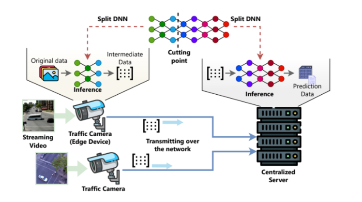
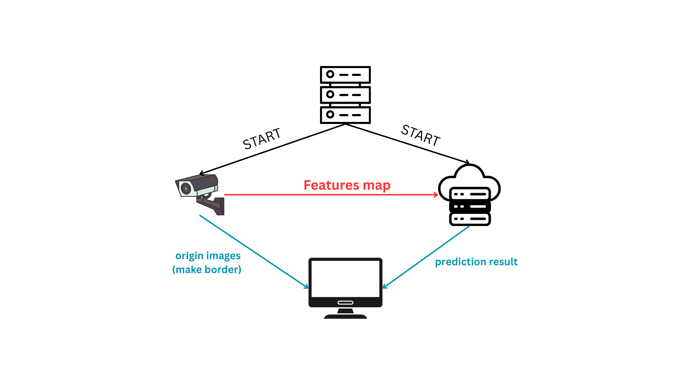
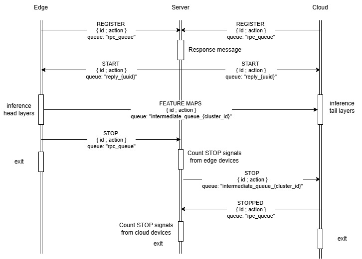

# Split Inference

This project implements **Split Inference for YOLOv11** to enable real-time object detection on low-power **edge devices (Jetson Nano)** by dividing the neural network across multiple machines.

Instead of transmitting full video frames, the edge device executes the first part of the model (**head**) and sends only **intermediate feature maps** to another device that runs the remaining layers (**tail**).

---

# Table of Contents

* [Overview](#overview)
* [Architecture](#architecture)
<!-- * [Data Flow](#data-flow) -->
* [Pipeline](#pipeline)
* [Project Structure](#project-structure)
* [How to Run](#how-to-run)

  * [Clone Repository](#1-clone-the-repository)
  * [Install Dependencies](#2-install-dependencies)
  * [Start RabbitMQ](#3-start-rabbitmq)
* [Configuration](#configuration)
* [Running the System](#running-the-system)
* [Automatic Partitioning](#automatic-partitioning)
* [Tested Hardware](#tested-hardware)
* [Application Scenarios](#application-scenarios)
* [License](#license)

---

# Overview

<p align="center">
  
</p>

In traditional edge AI pipelines, raw video frames are transmitted to a centralized server for processing. This creates high network bandwidth usage and latency.

**Split inference** solves this by dividing the neural network into two parts:

1. **Head (Edge Device)** – processes the early layers of the model.
2. **Tail (Server / Cloud)** – processes the remaining layers.

Only **intermediate feature maps** are transmitted instead of full images, reducing bandwidth and improving scalability.

---

# Architecture

The system consists of four main components.

## Stage 1 – Edge Device (Head)

Devices located at the edge such as **traffic cameras or embedded devices (Jetson Nano)**.

Responsibilities:

* Capture video frames
* Run the first layers of YOLOv11
* Compress intermediate feature maps using quantization
* Send feature maps to the network

---

## Stage 2 – Tail Device (Tail)

Devices located in the **cloud or high-performance servers**.

Responsibilities:

* Receive feature maps from edge devices
* Run the remaining layers of the neural network
* Produce final detection results

---

## Server – Controller

Central coordination service responsible for:

* Registering clients
* Selecting model cut-layers
* Managing inference workflow
* Coordinating communication using **RabbitMQ**


---
<!-- 
# Data Flow

<p align="center">
  
</p>

The system workflow:

1. Edge device captures video frames.
2. The head model processes early layers.
3. Intermediate **feature maps** are transmitted through the network.
4. Tail device completes the inference. -->

---

# Pipeline

<p align="center">
  
</p>

Pipeline steps:

1. Clients register with the server.
2. Server collects device information.
2. The model is split and inference begins.

---

# Project Structure

```
split_inference/
│
├── client.py          # Edge or tail inference node
├── server.py          # Central controller
├── config.yaml        # System configuration
├── requirements.txt   # Python dependencies
│
├── imgs/              # Images used in README
|   ├── overview.png
│   └── SI-Inference.jpg
│
├── guide/             # The portable result-format specification + validators
│   ├── 01-result-format.md   # normative: the contract every log line obeys
│   ├── validate_results.py   # conformance check for a run directory
│   └── validate_palette.py   # colourblind-safety check for the chart palette
│
├── tools/
│   ├── selftest_format.py  # format conformance without a broker (guide/09 phase 6)
│   ├── build_nb.py    # emits the visualization notebook (guide/08)
│   └── run_nb.py      # executes it headless, reporting every cell error
│
├── src/               # Core framework modules
│   ├── Server.py      # controller: dispatch, collection, rollups, archive
│   ├── Scheduler.py   # per-device tier loops and their instrumentation
│   ├── Results.py     # result-format line builders + the archiver
│   ├── FreeTime.py    # per-device idle tracking      (guide/10)
│   ├── BrokerRam.py   # RabbitMQ host RAM sampling    (guide/11)
│   └── MessageSize.py # payload size on the wire      (guide/12)
│
└── results/           # Archived runs (git-ignored) + the notebook (tracked)
```

---

# How to Run

## 1. Clone the repository

```bash
git clone https://github.com/filrg/split_inference
cd split_inference
```

---

## 2. Install dependencies

Python **3.8 or higher** is required.

```bash
pip install -r requirements.txt
```

---

## 3. Start RabbitMQ

RabbitMQ is used for communication between distributed components.

RabbitMQ admin interface:

```
http://localhost:15672
```

Default credentials:

```
username: guest
password: guest
```

---

# Configuration

Edit **config.yaml** before running the system.

Example configuration:

```yaml
name: YOLO
server:
  cut-layer: a # or b, c, d
  clients:
    - 1
    - 1
  model: yolo26n
  batch-size: 5
rabbit:
  address: 127.0.0.1
  username: guest
  password: guest
  virtual-host: /

debug-mode: False
data: videos/video.mp4
log-path: .
control-count: 1
compress:
  enable: True
  num_bit: 8
```

Feature map compression:

```yaml
compress:
  enable: True
  num_bit: 8
```

---

# Running the System

## Step 1 – Start Server

```bash
python server.py
```

---

## Step 2 – Start Clients

Edge device:

```bash
python client.py --layer_id 1
```

Optional CPU mode:

```bash
python client.py --layer_id 1 --device cpu
```

Tail device:

```bash
python client.py --layer_id 2
```

---

# Tested Hardware

| Device           | Role                   |
| ---------------- | ---------------------- |
| Jetson Nano      | Edge Client (Head)     |
| Jetson Nano      | Tail Client            |
| Laptop / Desktop | Tracker                |
| LAN Network      | RabbitMQ communication |

---

# Application Scenarios

* Smart traffic monitoring
* Edge surveillance AI
* Distributed deep learning research
* Bandwidth reduction experiments

---

# Metrics

After each run, the system produces `metrics_pivoted.csv` with one row per batch. Below is a description of each column.

---

## Column Descriptions

| Column | Description |
|---|---|
| `batch_id` | Row index in the CSV. When multiple devices run simultaneously, rows from all devices are interleaved into one file. |
| `batch_size` | Number of frames processed together in one model forward pass. |
| `best_cut` | Layer index chosen by the Hungarian algorithm to split the model. Edge runs layers from the start up to `best_cut`, cloud runs the remaining layers. |

---

## Latency

Measured independently at each device using:
```
batch_start = time.perf_counter()   # immediately before processing
# run assigned model layers, compress / decompress, send / receive
batch_end   = time.perf_counter()

latency_ms = (batch_end - batch_start) × 1000
```

- **edge_latency_ms** — total time for the edge device to process one batch: includes running its assigned model layers, compressing the feature map, and publishing the message to the queue.
- **cloud_latency_ms** — total time for the cloud device to process one batch: includes receiving the message, decompressing the feature map, running its assigned model layers, and postprocessing the results.

---

## FPS

Measured independently at each device using:
```
fps = batch_size / (batch_end - prev_batch_end)
```

`prev_batch_end` is the finish time of the previous batch on the same device, so FPS reflects how many frames that device completes per second between two consecutive batches. The first batch of every device always reports **0.0** because there is no previous batch to compare against.

The **total system FPS** is the sum of the per-device average FPS across all final devices (cloud devices in split/only-cloud mode, edge devices in only-edge mode), since all final devices process frames in parallel. The first-batch **0.0** values are excluded from the per-device average so they do not distort the result.

> For the authoritative system-wide number, see [System FPS (fps_queue)](#system-fps-fps_queue) below — it is measured live on a single clock at the server, so it cannot be distorted by clock skew or per-device averaging.

---

## System FPS (fps_queue)

The server measures **real system throughput** centrally, while the run is going, using a dedicated `fps_queue`:

```
edge/cloud finishes a batch  →  publishes its cluster id  →  server records arrival time

SYSTEM FPS = total frames / total time
           = (number of DONEs × batch_size) / (last DONE − START broadcast)
```

The ping body is an **identity** (the producing cluster, e.g. `intermediate_queue_0`), never a measurement. The server reads it only to bucket the arrival for the per-cluster breakdown; the system total counts every arrival regardless of body, so a garbled or unrecognised body can shift the breakdown but can never move the total.

**Who sends the "DONE"** — only the device that *completes* a batch, so one DONE always equals exactly `batch_size` frames and nothing is counted twice:

| Mode | Sender |
|---|---|
| `split`, `only_cloud` | cloud |
| `only_edge` | edge |
| `adaptive` | edge for `edge_only` batches, cloud for `split` batches |

**Why arrival counting instead of averaging rates** — the message body carries no data; the server timestamps each arrival with **its own clock**, so clock differences between devices cannot distort the measurement. Averaging per-batch instantaneous FPS (`batch_size / delta`) is deliberately avoided: DONEs arrive in bursts, and the burst intervals produce huge FPS entries that inflate an arithmetic mean far above the rate the system actually sustains (e.g. a run measured 28.3 fps true throughput while the mean of instantaneous values read 133.7).

**Live output** — from the 16th DONE on, the server prints the smoothed window rate:

```
[FPS] DONE #42  window_fps= 64.10 (last 16 batches)
```

`window_fps` is `15 × batch_size / (t[-1] − t[-16])` — frames over the last 16 DONEs. The first 15 batches print nothing, because there is no window yet.

**Final summary** — printed when the run ends:

```
============================================================
  [SYSTEM FPS]        28.331 fps   = 252 DONE x 32 / 284.64s  (START -> last DONE)
  [steady-state]      28.899 fps   = 251 x 32 / 277.93s  (first -> last DONE)
  [ref mean, N/U]    133.709 fps   (arithmetic mean of 1/dt — reference only, biased high)
  batches counted: 252   stop reason: work queues drained + grace
============================================================
```

- **SYSTEM FPS** — whole run including warm-up (model load, first batch in flight)
- **steady-state FPS** — excludes warm-up; use this when comparing modes or cut points
- **ref mean, N/U** — arithmetic mean of the instantaneous per-DONE rates; DONEs arrive in bursts so this reads far above real throughput (133.7 vs 28.3 here). Printed for reference only — never use it as the system FPS.

**Shutdown safety** — the STOP protocol fires when all edges finish *sending*, but clouds are usually still draining queued batches at that point. The server does not exit then: it keeps collecting DONEs while `intermediate_queue` / `bbox_queue` (and any per-cluster queues) are non-empty, plus a 10 s grace period for the final in-flight batch, so backlog processed after the edges finish is still counted in the summary.

---

## Run Result Files

The server emits the portable result format specified in [`guide/`](guide/) — plain-text files in `log-path`, every line starting with a nanosecond-epoch timestamp taken on the **server's** clock followed by `key=value` pairs. **All** of them are truncated at server startup, including the ones whose feature is switched off, so the directory always describes exactly one run and a present-but-empty file is a valid "this run had none".

| File | Written | One line per |
|---|---|---|
| `batch_done_ns.log` | live | completed batch (system throughput series) |
| `fps_cluster_ns.log` | live | completed batch, cluster-tagged |
| `fps_cluster.log` | shutdown | cluster + one `SYSTEM` line (throughput summary) |
| `utilization.log` | shutdown | device (busy ratio) |
| `utilization_cluster.log` | shutdown | cluster, cluster×role, `SYSTEM` |
| `latency_cluster.log` | shutdown | cluster×role×kind, cluster e2e, `SYSTEM` e2e |
| `events_ns.log` | live | adaptive route flip |
| `free_time.log` | shutdown | device (idle wall clock) |
| `free_time_cluster.log` | shutdown | cluster, cluster×role, `FREE` reason, `KIND`, `MACHINE`, `SYSTEM` |
| `free_time_series.log` | shutdown | device per time bucket |
| `broker_ram_ns.log` | live | RAM sample of the RabbitMQ host |
| `broker_ram.log` | shutdown | `BROKER` / `USED` / `DELTA` / `RABBIT`, then `PHASE` per phase + `COMPARE` |
| `message_size.log` | shutdown | measured worker (normally exactly one) |
| `message_size_series.log` | shutdown | published message |

The last seven are the three **optional measurements**, each all-its-files-or-none, each switched by a flag in `config.yaml`:

| Feature | Flag | Measures |
|---|---|---|
| Free time (`guide/10`) | `free-time.enable` | the wall clock in which a device did **nothing at all** — run span minus the *union* of every lane's busy intervals. Not utilization and not `1 − utilization`: a back-pressure wait inside a unit window is busy for one and free for the other, and capture work on another lane is the reverse. Emit both; when they disagree loudly, the gap is the finding. |
| Broker RAM (`guide/11`) | `broker-ram.enable` | the RabbitMQ host, which runs no code of ours, sampled by the server over **one** long-lived SSH session (never a connection per sample). The window opens at controller start and closes a second past the drain, so `idle`/`run`/`tail` phases turn "this host was using N MB" into "running the system costs this host +N MB". |
| Message size (`guide/12`) | `message-size.enable` | the serialized bytes one worker hands to pika, recorded **before** each publish. Exactly one worker measures — the first edge to register — and the **server** picks it and says so in the dispatch message. |

Every one of those flags lives only in the server's `config.yaml` and travels to the workers inside the `START` message; no client reads a measurement setting from its own file. Turning a flag off also skips the server's own shutdown collector for it, so shutdown never burns a timeout polling a queue nobody will publish to.

This project uses the **`cluster`** filename scheme (never mixed with the `group_*` scheme — see `guide/01-result-format.md` §2). How the guide's neutral terms map here:

| Guide term | Here |
|---|---|
| unit / unit size | one batch / `server.batch-size` |
| worker, role | an edge or cloud client; `edge` / `cloud` |
| group | a cluster — `intermediate_queue`, or `intermediate_queue_k` with Hungarian clustering |
| completing tier | whichever tier emits the DONE (see the table above) |
| control event | an adaptive route flip between `split` and `edge_only` |

**Latency kinds** — `service` is a device's own `get input → output`, so it sums exactly to that device's `busy_s`; `pipeline` additionally covers the wait while a batch fills with frames (edge) and equals `service` on the cloud, which has no in-process hand-off queue; `e2e` runs from the edge starting a batch to the completing tier's output and is reported **only** by the tier that completed it, so each batch is counted once. Percentiles are nearest-rank over pooled raw samples — devices ship sample arrays, the server pools then reduces, because percentiles cannot validly be averaged across devices.

**Archiving** — at shutdown the logs plus the `config.yaml` that produced them are copied to `results/results_<MMDD>_<HHMM>_<tag>/`, where `tag` is the mode (`adaptive` / `only_edge` / `only_cloud`) or `dynamic` / `split`. Empty files are skipped and collisions get a `-2` suffix. Archiving is best-effort — a failure warns and the run still exits cleanly.

**Checking conformance** — run the validator on a run directory before charting it:

```bash
python guide/validate_results.py . --names cluster
python guide/validate_results.py results/results_0801_1556_adaptive --names cluster
```

It catches the measurement bugs that code review does not: two tiers pinging the same batch (cluster `done` sums past `SYSTEM`), a tier that stopped reporting early (line-count mismatch between `batch_done_ns.log` and `fps_cluster_ns.log`), overlapping busy intervals (utilization above 100%), percentiles computed on pre-averaged data (`p50 > p95`), busy intervals summed instead of merged (`busy_s + free_s != span_s`), and free-time attribution that leaks (reason shares not summing to 100%).

Both of those commands need a finished distributed run. To check the **format** without one — after touching a line builder, or on a machine with no broker — run the self-test:

```bash
python tools/selftest_format.py
```

It builds a run directory out of the real line builders (`src/Results.py`, `FreeTime`, `MessageSize`, `BrokerRam`) fed synthetic device reports, validates it, and then corrupts a copy eleven ways — one per row of the common-failures table in `guide/09-port-checklist.md` — asserting the validator rejects each and names the check that fired. A validator nobody has ever seen fail is not evidence. Add `--keep results` to leave two fixture runs behind for exercising the charts; the numbers in them are synthetic, so never archive or quote one.

**Charting** — the notebook renders any conforming run directory with no chart-code changes, which is the entire point of fixing the format. It discovers every subdirectory of `results/` holding a `batch_done_ns.log` and treats it as one run, so a single run works and two runs additionally get the comparison chart.

```bash
python tools/build_nb.py && python tools/run_nb.py
# -> results/visual/Result Visualization.ipynb, charts in results/imgs/
```

Fix a chart in `tools/build_nb.py` and re-run both — never patch the `.ipynb` directly, because the next build silently reverts it. Only the notebook is tracked in git; run data and rendered PNGs are not, so a checkout never carries someone else's numbers.

---

## RAM

```
ram_mb = psutil.Process(os.getpid()).memory_info().rss / (1024 × 1024)
```

Reports the **Resident Set Size (RSS)** — physical RAM occupied by that process at the end of each batch. Does not include memory used by other processes on the same machine.

---

## Message Size

Both values are measured on every batch.

- **edge_message_size_bytes** — size in bytes of the pickle-serialized message measured by the edge immediately before publishing to RabbitMQ. When compression is enabled, the message contains the first frame in full (quantized) plus delta-encoded subsequent frames, so this value varies per batch depending on motion between frames within the batch. When compression is disabled, all frames are sent as raw tensors and the size is fixed.

- **cloud_message_size_bytes** — size in bytes of the raw message received by the cloud from RabbitMQ. This is the same bytes as `edge_message_size_bytes` arriving on the receiving end, so the two columns reflect the same message and should be equal each batch.

---

## End-to-End Latency

The edge embeds its processing start time inside every message it sends:
```
edge side : y = {"edge_start_time": batch_start, ...}

cloud side: e2e_latency_ms = (cloud_batch_end - edge_start_time) × 1000
```

This captures the full pipeline latency for one batch:
```
e2e = edge_latency + queue_wait_time + cloud_latency
```

**Queue wait time** is the time a batch spends waiting inside the RabbitMQ intermediate queue before the cloud picks it up. If edge devices send faster than cloud devices can process, batches accumulate in the queue and each subsequent batch waits longer, causing e2e to grow over time. A growing e2e is a sign that the system is unbalanced at the chosen cut point.

> **Note:** `batch_start` is recorded after all frames in the batch have been read from the video, so video I/O time is **not** included. E2E measures inference pipeline latency only.

---

# License

See [LICENSE](./LICENSE)
